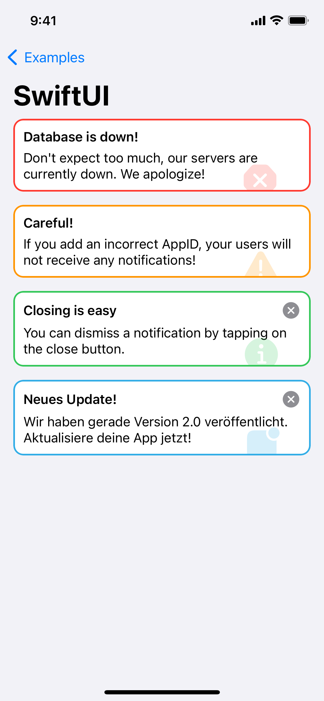
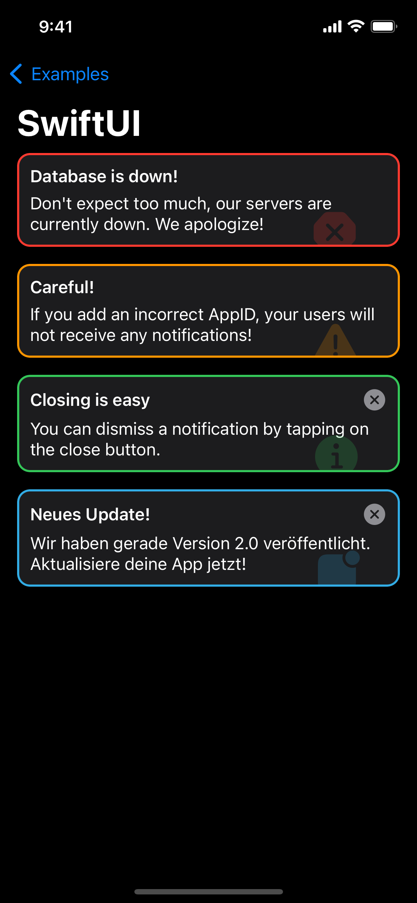
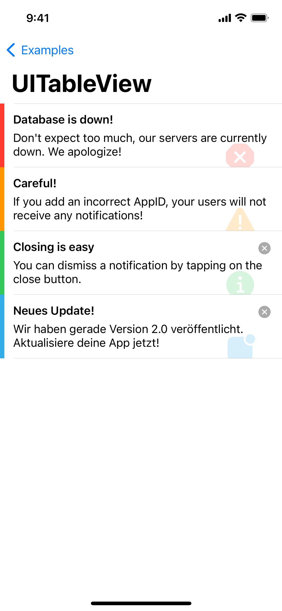
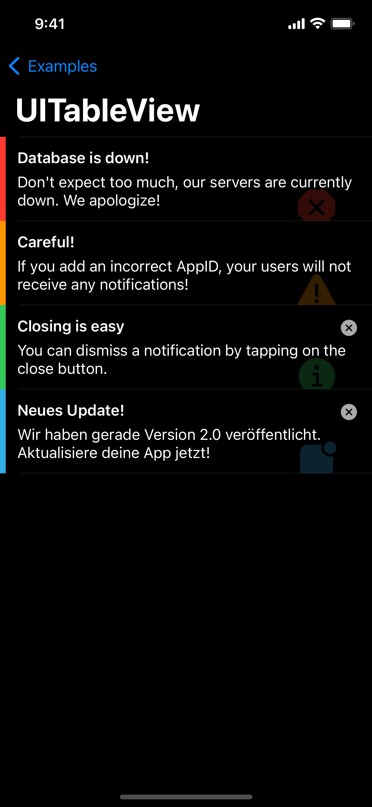
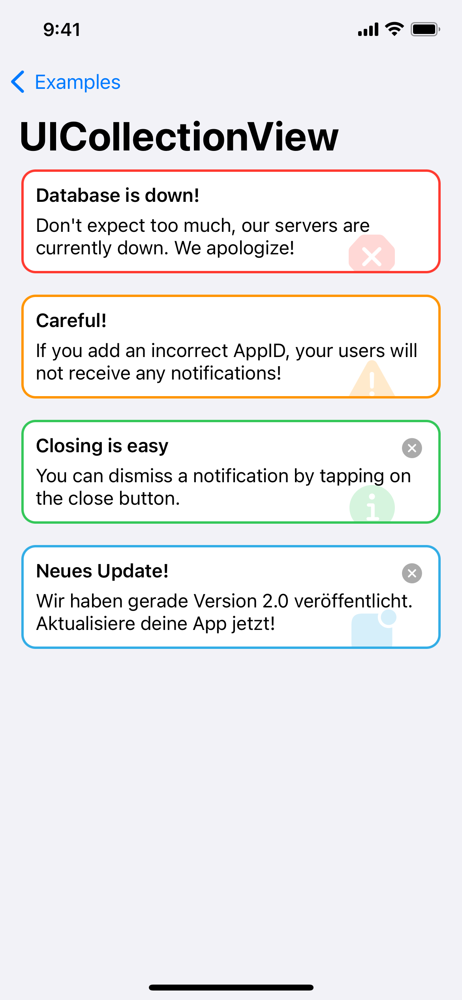
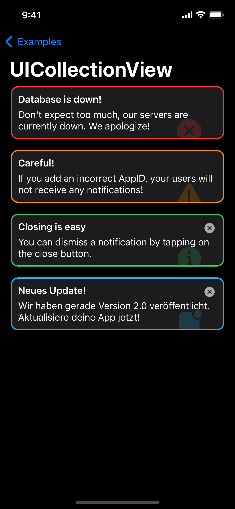

# AppState.dev

Swift Package for simple and fast integration of AppState.dev into iOS apps.


---


## Content
- [Features](#features)
- [Screenshots](#screenshots)
- [Installation](#installation)
- [How to Use](#how-to-use)


## Features
- [x] Fetch active notifications for your app
- [x] Read notifications as JSON with the integrated decodable model
- [x] Use one of our templates for SwiftUI, UITableView or UICollectionView
- [x] Hide notifications (if their type can be dismissed)
- [x] Restore hidden notifications


## Screenshots
#### SwiftUI
 

#### UITableView
 

#### UICollectionView
 


## Installation
##### Requirements
- iOS 14.0+ / macOS 12.0
- Xcode 13+
- Swift 5+

##### Swift Package Manager
In Xcode, go to `File > Add Packages` and add `https://github.com/kaevinio/AppState`. Add the package to all your targets.


## How to Use
##### Fetching Notifications
All active notifications are fetched and kept in the `AppStateManager` within the package.
To initially fetch your notifications you need to `import AppState` and then set your appID:
```Swift
let appId = "<Your app's ID>"
AppStateManager.shared.setAppID(appId)
```
**Important**: You can find your app's ID in the macOS/iPadOS app by tapping on the info button in your app details.

By setting the ID, your notifications are fetched automatically. From now on, they can be accessed by calling their value:

```Swift
AppStateManager.shared.states.value
```
**Important**: You need to call  `.value` on the `states` property because they are stored in a `CurrentValueSubject` using the `Combine` framework.

The **Example** directory fetches notifications from a local JSON file containing exemplary notifications. The file represents the answer you get from our API.

##### Using Templates
You can use the built-in templates for SwiftUI, UITableViews and UICollectionViews.
When setting up your views, simply `import AppState` on the top of your file and call the respective view. An exemplary integration for a UICollectionView is as follows:

```Swift
let appStateCell = UICollectionView.CellRegistration<AppStateCollectionViewCell, SectionItem> { _, _, _ in }
```
The reusable component here is `AppStateCollectionViewCell`.

In the **Example** directory you can find demo code to show how to setup all templates within their respective views.
